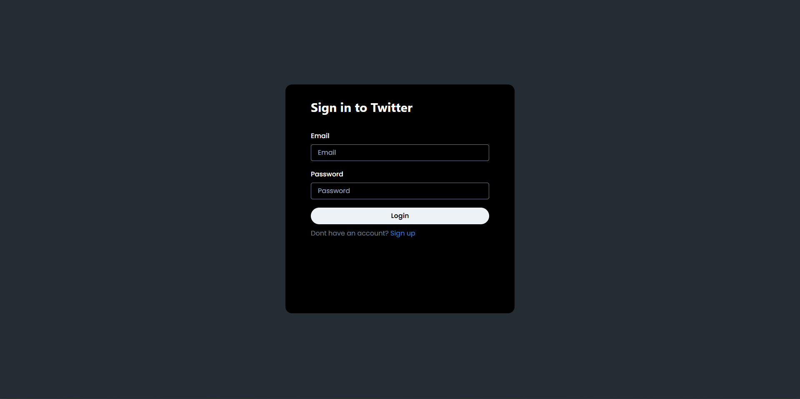
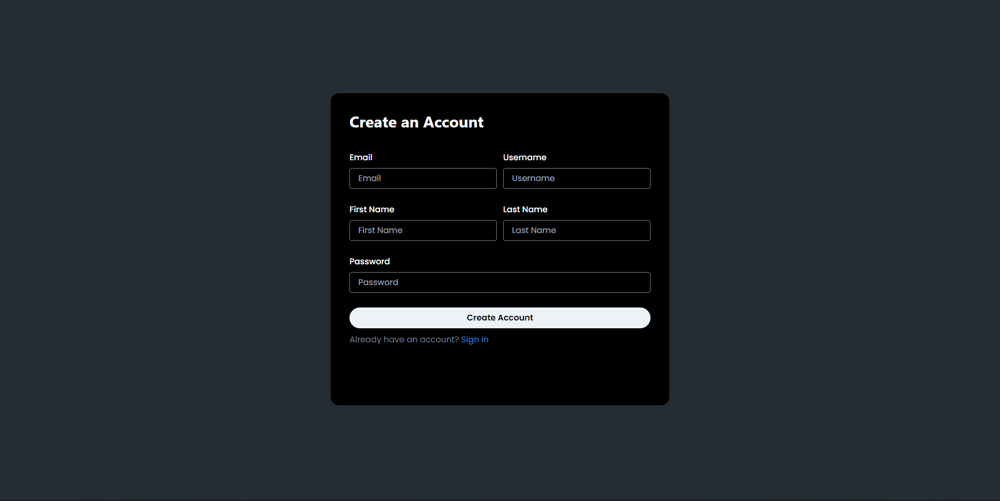
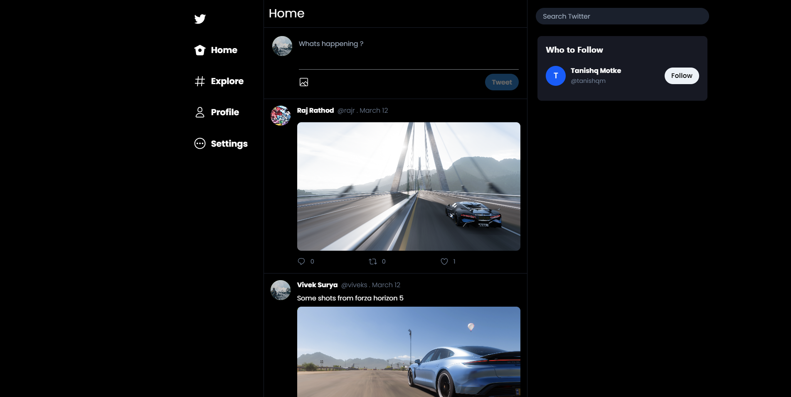
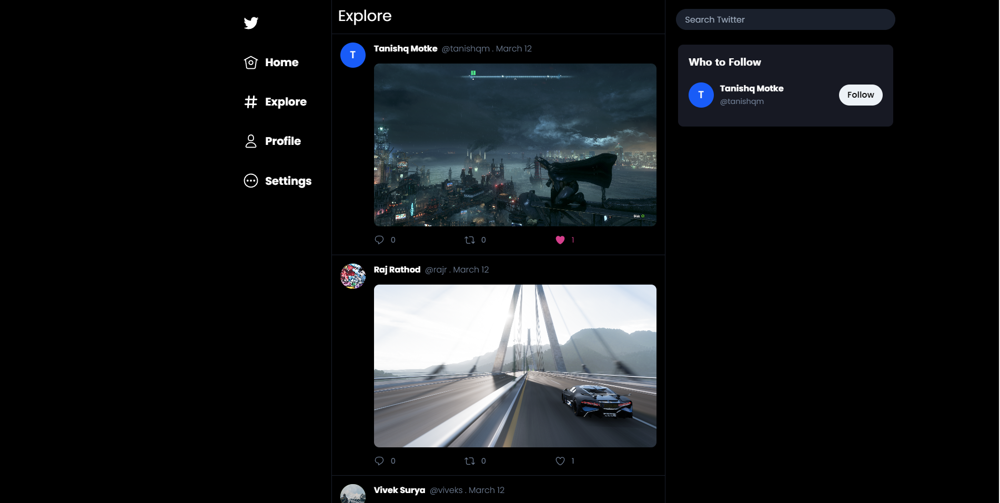
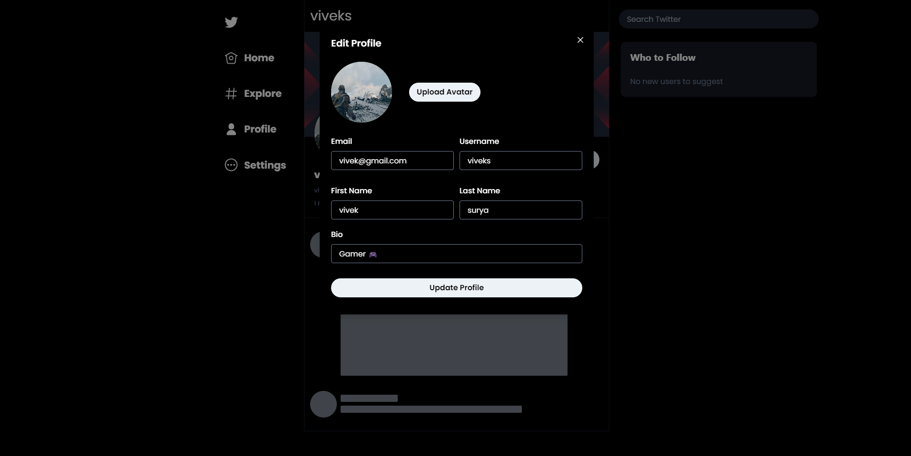
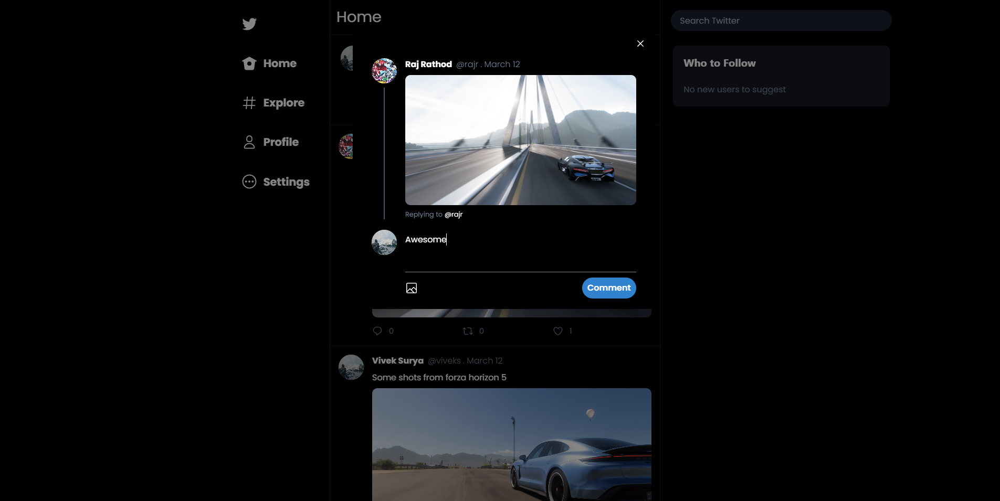

## Twitter Clone

> Twitter clone made using typescript, Next.js, Node.js, prisma, apollo graphql server and chakra UI (WIP).

## Screenshots
Login


Register


Home


Explore


Profile


Comments


## Installation

Clone the repo:

```

git clone --depth https://github.com/viveks77/twitter-clone.git

```
Install the dependencies:

```

yarn

```

## Commands 

Running locally :  ``yarn run dev``

Open http://localhost:3000 with your browser to see the result.

## Dependencies

- @prisma/client: ^3.15.2
- apollo-server: ^3.6.3
- express: ^4.17.3
- type-graphql: ^1.1.1
- @apollo/client: ^3.5.10
- @chakra-ui/react: ^1.8.6
- @graphql-codegen/cli: ^2.6.2
- formik: ^2.2.9
- graphql: ^16.3.0
